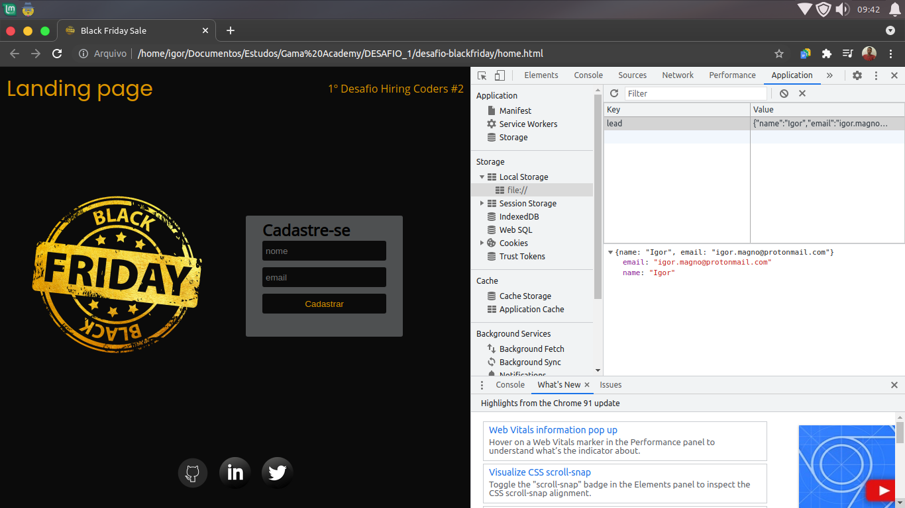

# Hiring Coders #2 - VTEX & GAMA ACADEMY
## Desafio 1 - Landing Page
### Divisão do projeto

home.html

- Página única com o objetivo de capturar informação e armazenar no Local Storage.

diretório styles

- Armazena duas folhas de estilo, uma contendo configurações globais e reset do browser enquanto a outra cuida da estilização da landing page.

diretório assets

- Contém mais dois diretórios, icons e images, para carregar respectivamente links de redes sociais e imagens da landing page.

diretório components

- Responsável pela parte lógica do projeto, carrega arquivo javascript usado para validação dos dados.

Commit | Contém
:-----------:|:----------------------------:
 fa7941d4dd9 | home.html
 9a5a5864474 | assets/ -> icons/ e images/
 ed4bdc0d1bf | styles/
 0fe31390ef4 | components/

_**[Hospedagem Netlify](https://60f42b922a071f7e0fd39045--tender-knuth-67dacd.netlify.app/)**_
